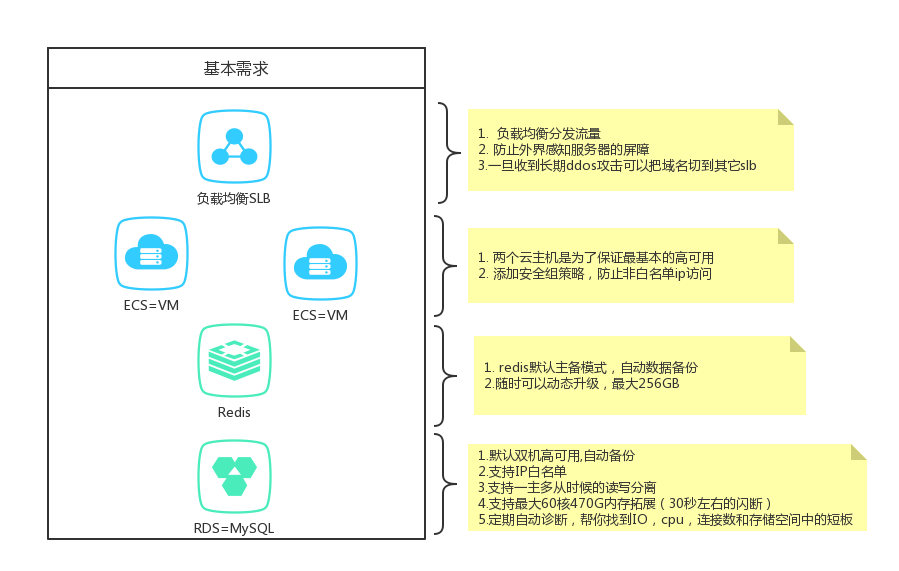
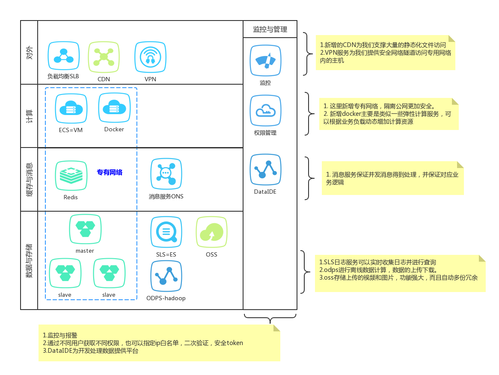
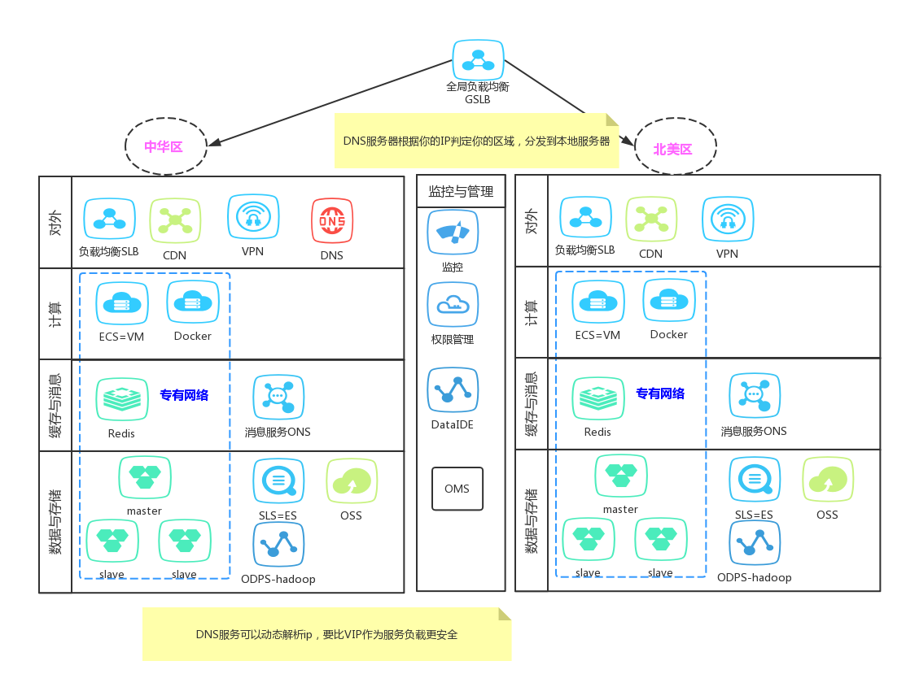

随着互联网发展，以前服务器租赁，简单云主机已经不能满足人们需求。
- 因为以前服务器租赁花费准备周期长，费用高，而且服务不稳定。
- 简单的云主机都是直接面向公网较危险，服务单一。

然后演化出现有的公有云，阿里云则是里面做的比较好，迭代迅速基本能满足我们现有需求。

##一期目标
如何在阿里云构建一个稳定可靠的系统，首先我们考虑到两个方面：
- 安全，稳定
- 且能满足快速增长的需求

[ECS，RDS，SLB，KvStore创建方法](./aliyun_sm.md)

我们这里根据一个15倍的设计理念，1.5倍的实施来做，得出一个最简web架构如下：

上面的架构基于“阿里云VPC专用网络”基本上能满足业务量，如果计算量增加`添加ECS节点`即可，如果缓存增加`拓展redis节点即可`，
数据量增加我们可以增加`云数据库`节点进行读写分离，也可以升级`数据库的配置`。总之我们不会在任何缓解看到瓶颈。

实际操作流程如下：

1. 创建VPC网络并购买共享带宽包（公网IP）
2. 创建专用网络下SLB
3. 创建专用网络下ECS
4. 创建专用网络下RDS
5. 创建专用网络下的KvStore

##二期目标

当架构能完全支撑我们的服务后我们肯定还是难以满足，因为我们需要更多好东西。
- 权限精细化管理
- 数据安全,可视化
- 危机预警机制

##三期目标
下面是一个大型的网站，主要区别在于全局负载均衡：

1.全局负载均衡可以在DNS解析阶段把用户本地化访问
2.当出现故障时可以动态迁移用户到非故障区域
3.同区域内全局负载均衡也可以分发请求

