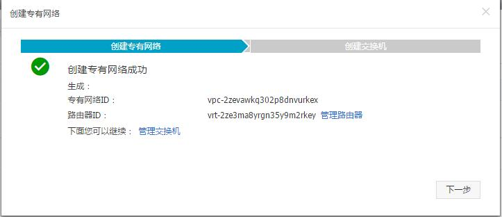
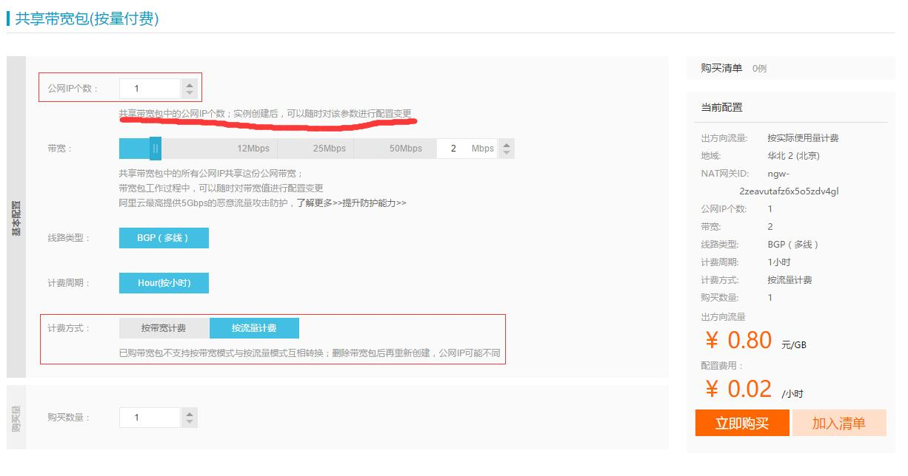
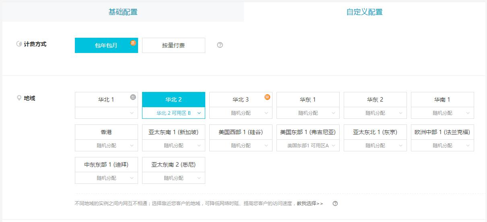
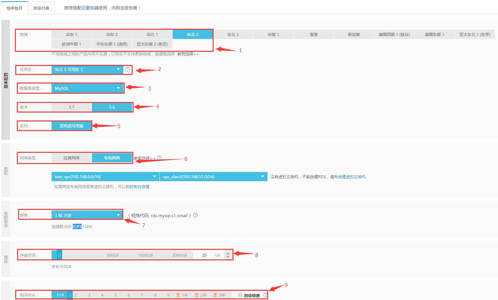
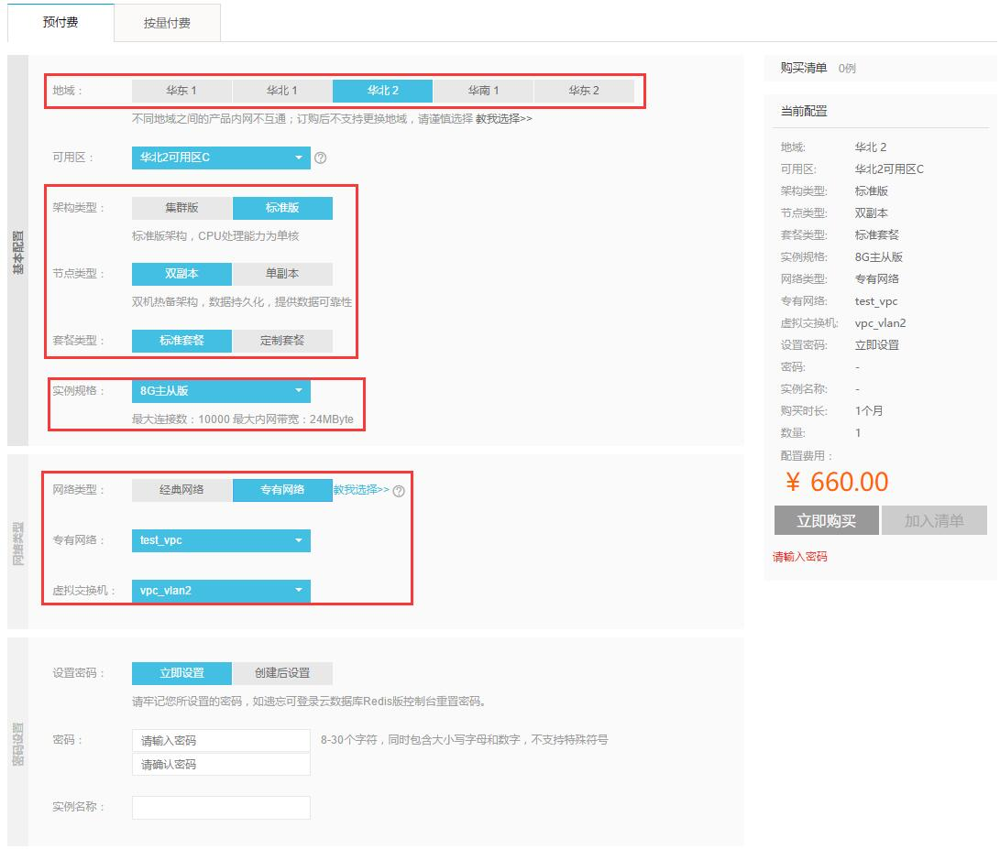

##小型阿里云架构搭建
* [1. 创建VPC网络并购买共享带宽包（公网IP）](#1)

[2. 创建专用网络下ECS](#2)

[3. 创建专用网络下RDS](#3)

[4. 创建专用网络下的KvStore(Redis)](#4)

[5. 创建专用网络下SLB](#5)

开始教程
 ---

<h3 id="1">1. 首先需要创建一个VPC网络，使你的服务和公网隔离，保证基本网络安全</h3>

####1.1 创建VPC
所有在VPC里面创建的应用都会占用一个内网IP。

1.1.1 创建交换机

__注意__：有部分区域不支持VPC网络，例如：华北2C区不支持VPC的

####1.2 创建网关SNAT

这里的网关和公司路由器差不多是整个VPC流量的出入口功能如下：
- 端口转发
- IP映射
- 带宽包绑定

####1.3 创建共享带宽包
因为VPC本身是一个隔离网络，外部无法访问访问，所以我们需要购买宽带，带宽自带公网IP
购买带宽的时候需要注意：
- 需要的公网IP数
- 按需付费还是按带宽（如果流量稳定建议按带宽，如果浮动大建议按需付费）

---

<h3 id="2">2. 创建专用网络下ECS </h3>

#### 2.1 选择区域
注意：这里分为`区域`和`可用区`, 专用网络同一区域内不同可用区是可以通讯（所以你可能看到你`华北2A区`的主机连接到`华北2B区`redis
）总结有一下几个关注点：

- 同一地域的VPC下交换机可以是任何区域
- 同地区不通区域服务器的品类不通
- 不同区域公共资源储量不一样

#### 2.2 选择网络

2.2.1 这里只介绍专有网络（VPC）

2.2.2 选择你创建好的VPC和虚拟交换机，这决定你的ecs将运行的ip网段

2.2.3 注意： 公网IP地址尽量别分配，ecs创建时分配的公网IP会跟随ecs一生，无法解绑。它会破还你网络隔离的现状让云主机暴露在公网。

2.2.4 安全组是个好东西，它可以帮你限制暴露在网络中端口，限制IP访问，达到IP和端口黑名单的效果

#### 2.3 选择实例型号
选对型号很重要决定你的应用单机计算量：
- `系列1比较老旧版本`，硬件没有经过优化同等配置效率要比系列2的低>30%.
- 系列1的部分主机的IO优化是可以选择的，一旦选择`非IO优化就无法挂载SSD和高效云盘`
- 正常情况你可以选择系列2提供对用场景下的机型。
- 系列3是系列2CPU升级版本。系列之间不能互相升降配。

#### 2.3 选择实例镜像和硬盘
2.3.1 实例镜像
- 公共镜像提供有centos，Ubuntu，windows(激活码单独收费)等等，记得选择你需要的系统版本
- 即使你选择错系统后也不需要着急，购买后也可以改系统

2.3.2 硬盘
分为两部分：系统盘和数据盘
云盘也分为三种：普通云盘，高效云盘，SSD云盘读写效率也依次提高（价格也不一样）

#### 2.3 选择实例购买量和密码
- 这里只要注意你的需求是够长期，如果超过1年尽量一次购买这个会有优惠
- 一次购买多台同等配置直接填好几台
- 密码这里能改成密钥当然是最好的

---

<h3 id=3> 3. 创建专用网络下RDS </h3>
RDS的区域和ECS特性差不多，主要区别在于RDS型号可以使用‘双机高可用’，‘独享套餐（独享CPU和IO）’，‘单机实例’
我们目前中小型业务，实时性能要求一般的`双机高可用`就可以。
- 默认主备，备份实例只能做故障切换
- 默认自动备份
- 支持读写分离
- 支持sql分析

数据库配置和使用信息概览

性能仪表盘

SQL命令窗口

---

<h3 id=4> 4. 创建专用网络下的KvStore(Redis) </h3>
缓存主要关注三点：
- 访问速度
- 存储容量
- 数据安全

注意：阿里云专用网络内的redis不会提供公网地址

因为都是内存缓存速度已经极快，我们亲身实践中阿里云主从实例可达到6w+的QPS.

阿里云的KvStore架构分为`集群版`和`标准版`：

-    集群版支持最低64G最大256G内存配置费用较为高昂.
-    标准版：包含`单副本`和`双副本`，双副本又包括`主从版本`和`高配版`，这里的高配是指__连接数__和__带宽__

---

<h3 id=5> 5. 创建专用网络下SLB </h3> 

采购

添加监听

添加

添加服务器到负载均衡，主要主要的参数就是添加每台机器的权重

